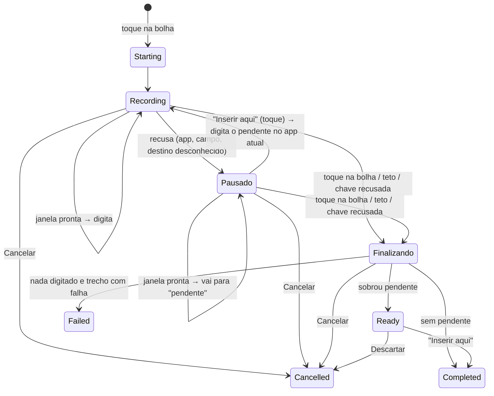

# P138 e P139 — bolha arrastável e inserção direta com prévia

**Status:** [~] em andamento (0.5.0)

Dois achados do uso real no S26:

- **P138:** a bolha fica presa no canto inferior direito, sobre o teclado
  (1132,2465–1398,2731 num S26 de 1440×3120). Cobre a tecla de ação e o
  microfone "Ditar nesta nota" (P27, P123).
- **P139:** ditar em outro app pede cinco passos: gravar, ver a barra, tocar
  em Inserir, ver o texto final e tocar de novo. O desejado é tocar na bolha e
  o texto ir sendo digitado no campo aberto, com uma prévia do que está sendo
  transcrito e do que já foi escrito.

## P138 — bolha arrastável

### Comportamento

- **Toque curto** (dedo solto sem passar do *touch slop* do sistema, ~8 dp)
  aciona a bolha como hoje.
- **Arraste**: passou do *slop*, o gesto vira arraste até o fim. Soltar
  **nunca** conta como toque, e `ACTION_CANCEL` também não. Só o primeiro dedo
  vale.
- **Ao soltar**, a bolha encosta na borda lateral mais próxima (esquerda ou
  direita) e mantém a altura, limitada à área segura.
- **Área segura**: tela menos barras do sistema e recorte da câmera
  (`getInsetsIgnoringVisibility(systemBars | displayCutout)`), com 12 dp de
  margem, a mesma de antes.
- **Posição salva** como `(lado, fração vertical)`. A fração vai de 0, o topo da
  área segura, a 1, o ponto mais baixo onde a bolha cabe. Assim a posição
  sobrevive a rotação, troca de resolução e reinício. Fica em
  `SharedPreferences` próprias (`flowvoice_overlay`), fora do `AppPreferences`,
  que é sincronizado: posição de tela não faz sentido em outro aparelho.
- **Padrão**: lado direito, fração 0,3. Fica acima do teclado em retrato e
  longe da tecla de ação e do microfone das Notas.

```
 retrato (fração 0,3, direita)      paisagem (mesma fração)
 ┌──────────────┐                   ┌────────────────────────────┐
 │ status bar   │                   │                            │
 │           ◉  │ ← 30 % da faixa   │                         ◉  │
 │              │                   │                            │
 │   [teclado]  │                   │         [teclado]          │
 └──────────────┘                   └────────────────────────────┘
```

### Por que coordenadas brutas

A janela da bolha se move junto com o dedo. Coordenadas locais do Compose são
relativas a uma janela que acabou de mudar de lugar e fazem a bolha tremer. O
gesto usa `MotionEvent.rawX/rawY`, via `pointerInteropFilter`, e só o delta
desde o toque inicial: `nova posição = posição inicial + (raw − raw inicial)`.
A janela passa a ter gravidade `TOP|START`, e no Android 11+ usa
`fitInsetsTypes = 0`, para `x/y` serem coordenadas da tela.

### Acessibilidade

- O contêiner da bolha tem papel de botão, nome ("Ditar" ou "Encerrar ditado")
  e ação de clique.
- Três **ações personalizadas** do TalkBack ("Mover para cima", "Mover para
  baixo" e "Mover para o outro lado"): quem não arrasta pode reposicionar a
  bolha pelo menu de ações.
- A área de toque passa a ser a bolha inteira (76 dp), não só o círculo
  interno de 40 dp.

### Lógica pura (testada)

- `BubbleGesture`: toque ou arraste, com *slop*.
- `BubblePlacement`: limites, encaixe na borda, conversão da posição salva,
  ações de mover e janela da prévia.

## P139 — inserção direta com prévia

### Modos

| Modo | Quando | O que acontece |
| --- | --- | --- |
| **Direto** (padrão) | sessão de campo ativo (bolha ou microfone do Início) com "Revisar antes de inserir" desligado | cada janela transcrita é digitada no campo assim que fica pronta |
| **Revisar antes de inserir** | ajuste ligado | fluxo atual: barra acima do teclado, Inserir, revisão por IA opcional |
| **Nota** | `DictationTarget.Note` | inalterado: nunca digita em outro app (P99) |

O modo é decidido no `start()` e vale para a sessão inteira. Mudar o ajuste no
meio não afeta a sessão em curso.

### Estados da sessão direta



"Pausado" não é um status novo do pipeline: é `Recording` ou `Transcribing`
com `DirectInsertionProgress.pausedReason` preenchido. `Ready`, `Completed`,
`Cancelled` e `Failed` são os status de hoje. O overlay distingue a sessão
direta pelo `DirectInsertionProgress` da mesma sessão.

### Inserção incremental

- **Ordem**: `DirectInsertionPlanner` consome janelas pelo índice e só avança
  quando a janela `n` está resolvida (texto, silêncio ou falha). Uma janela
  pronta fora de ordem espera a anterior. Isso não depende da fila serial
  (`processMutex`), que hoje já garante a ordem.
- **Emenda**: o primeiro pedaço entra aparado. Os seguintes entram com um espaço
  antes, sem as palavras iniciais que repetem o fim do texto já consumido. É a
  mesma regra de `LivePreviewAssembler.mergeAdjacent` (P127), agora em
  `LivePreviewAssembler.continuation`. Como o que já foi digitado não se
  apaga, a sobreposição sai do pedaço **novo**. O texto digitado fica igual ao
  que a revisão montaria sem IA. A P127 continua aberta nos dois modos.
- **Dicionário**: aplicado a cada pedaço (troca palavra a palavra, então dá o
  mesmo resultado, exceto termo que caia na fronteira).
- **Falha de janela** (timeout, 402, 403…): a janela é pulada e o aviso
  "Trecho 2 de 5 falhou (timeout): texto incompleto" aparece na prévia na
  hora, e não só no fim.
- **Teto e chave recusada**: encerram a sessão como hoje (P92, P111), com o
  aviso no resultado.

### Segurança da inserção

Toda inserção **sem toque** (`TextInserter.insertWithoutTap`) passa por
`DirectInsertionGuard.refusal`, mais rígido que o `InsertionGuard` do fluxo com
toque:

1. FlowVoice em primeiro plano → recusa.
2. **Destino desconhecido** (app de início ou app atual nulo) → recusa. O
   `InsertionGuard` deixa passar esse caso porque ali o usuário tocou em
   Inserir; aqui ninguém tocou.
3. **App diferente** do de início → recusa.
4. **Campo diferente**: o serviço de acessibilidade conta início e fim de
   input (`InputMethod.onStartInput` sem `restarting` e `onFinishInput`). A
   primeira inserção fixa a geração, e as seguintes exigem a mesma. Trocar de
   conversa no WhatsApp, sair do campo para a lista ou ir a outro app e voltar
   gera um novo input e **pausa** (P85 e P114 ficam cobertas no modo direto).
   `restartInput` do mesmo campo (`restarting = true`) não conta.
5. Depois: campo de senha e campo do próprio FlowVoice, as travas de sempre em
   `insertDirect`/`insertFallback`.

Qualquer recusa ou falha **pausa a sessão até o fim**. Os pedaços seguintes vão
para "pendente" e nada mais é digitado sem toque, **mesmo que o foco volte ao
app de origem**: a volta pode ser noutra conversa do mesmo app. O botão
"Inserir aqui" recaptura o destino (app atual), digita o pendente e retoma a
digitação direta nesse campo, como na P113. Um toque até 1 s depois da pausa é
ignorado (toque duplo acidental).

**Microfone do Início**: a sessão começa com o FlowVoice na frente (destino
nulo). Ao reabrir o app anotado (P130), o Início fixa o destino nesse pacote
(`AccessibilityTextInserter.pinTarget`). Sem app anotado, o destino continua
desconhecido e a primeira janela fica pendente até "Inserir aqui".

### Revisão por IA

**Decisão: no modo direto não há revisão por IA.** Ela continua no ajuste
"Revisar antes de inserir" e nas notas.

- Revisar o todo depois é impossível: o texto já está no campo.
- Revisar por janela custa uma segunda requisição a cada ~4 s (dobra o custo e
  soma ~1–2 s por pedaço). Além disso, um trecho de 4 s não tem o contexto que
  a revisão precisa: pontuação e maiúscula dependem da frase, que atravessa
  janelas.
- Os dados do S26 (P132, P136) mostram que, com `gpt-transcribe`, a revisão só
  mexeu em vírgula e ponto final: o ganho é pequeno perto da latência.
- Quem quer revisão liga "Revisar antes de inserir" e tem o fluxo atual,
  inteiro.

O rótulo de "Revisão por IA" nos Ajustes passa a dizer que ela só vale ao
revisar antes de inserir e nas notas.

### Prévia

**Junto à bolha e longe do cursor** (decisão do usuário, 2026-09-15). A primeira
versão abria o cartão pela metade da tela em que a bolha estava. No S26 isso
cobriu a linha do cursor numa nota.

- A barra antiga fica logo acima do teclado, exatamente onde está o campo em chat
  (WhatsApp) e, em geral, o cursor em editor (Notas).
- **Janela própria.** O cartão não divide a janela com a bolha. Numa janela só, a
  parte transparente ao lado da bolha engoliria toques na linha do cursor. A
  janela da bolha não muda, então o ponto dela nunca pula.
- **Faixa útil:** do fim da barra de status e do recorte até o topo do teclado
  (`inputMethodTopOnScreen`, com 8 dp de folga), ou a base segura sem teclado.
- **O que evitar:**
  - A linha do cursor: retângulo do caractere antes de `textSelectionEnd`,
    obtido com `refreshWithExtraData(EXTRA_DATA_TEXT_CHARACTER_LOCATION_KEY)`.
    Margem de 12 dp, e a linha seguinte também fica livre, para o caso do cursor
    logo depois de uma quebra de linha.
  - Sem a linha, o campo em foco inteiro, se ocupar até 40 % da faixa.
  - Só coordenadas: o texto do campo não é lido.
- **Escolha** (`PreviewPlacement.vertical`, função pura): a parte de cima e a de
  baixo da linha são candidatas.
  - Entre as que cabem o cartão inteiro (altura estimada pelo conteúdo), vence a
    mais perto da bolha.
  - Se nenhuma cabe, fica a maior, com o cartão compacto: textos com menos
    linhas e rolagem, estado e botões sempre visíveis.
  - Se nem o compacto (96 dp) cabe, a prévia some até haver espaço.
  - O cartão só pode crescer até `maxHeight` na direção dele, e esse intervalo
    inteiro fica fora da linha: nem um cartão maior que o estimado a cobre.
- **Fallback:** linha desconhecida e campo grande (ou nenhum campo) → a regra
  antiga pela metade da bolha (para baixo na metade de cima, para cima na de
  baixo).
- **Na horizontal,** o cartão vai da bolha ao centro, sem cobri-la, com até
  360 dp.
- **Custo.** A posição só é lida com a prévia visível: ao abrir, quando o conteúdo
  muda (trecho digitado, pausa, resultado) e a cada 1 s, o que também pega o
  teclado mudando. A leitura roda na thread principal. A primeira versão lia em
  `Dispatchers.Default`, mas no S26 o nó com foco não vinha (campo e linha
  nulos), enquanto a mesma leitura na thread principal trouxe o campo e a linha.
  O log `overlay_preview_placed` só sai quando a escolha muda.
- Durante o arraste o cartão some e só a bolha acompanha o dedo; ao soltar, ele
  volta.

```
 bolha à direita, metade de cima            pausado (foco mudou)
 ┌──────────────────────────────────┐ ◉    ┌──────────────────────────────────┐ ◉
 │ ● 0:12  OUVINDO · TOQUE NA BOLHA │      │ ● 0:18  PAUSADO                  │
 │ NO CAMPO  …fechar o orçamento do │      │ o foco mudou de app; toque em    │
 │ ┄ transcrevendo…                 │      │ Inserir aqui para escrever no …  │
 │ [Cancelar]                       │      │ NO CAMPO  …fechar o orçamento    │
 └──────────────────────────────────┘      │ PENDENTE  do projeto ontem       │
                                           │ [Cancelar]        [Inserir aqui] │
                                           └──────────────────────────────────┘
```

- **Linha 1**: ponto de gravação, cronômetro e estado ("ouvindo · toque na
  bolha para encerrar", "finalizando", "pausado").
- **NO CAMPO**: fim do texto já digitado (até ~90 caracteres, cortado no começo
  da palavra). O rótulo diz onde o texto está, então fica claro o que o
  Cancelar **não** apaga.
- **transcrevendo…** (pontilhado, cor provisória): há janela em transcrição.
  Não há texto parcial de janela, porque a OpenRouter não faz streaming.
- **PENDENTE**: o que foi transcrito e não digitado (só em pausa).
- **Aviso**: trecho com falha ou motivo da pausa.
- **Botões**: "Cancelar" descarta só o que não foi digitado. "Inserir aqui"
  aparece com pendente.
- **Resultado** por 4 s: "Digitado no campo · N palavras" (com aviso), "Nada
  transcrito." ou "Falha no ditado".
- Cores de `FlowVoiceTheme` (claro e escuro): `surface`, borda `accentBorder`,
  texto `textPrimary`, provisório `provisional`, rótulos `textTertiary` e aviso
  `accentText`.
- Largura: área segura − bolha − margens, até 360 dp.

### Lógica pura (testada)

- `LivePreviewAssembler.continuation`: emenda.
- `DirectInsertionPlanner`: ordem e pedaços.
- `DirectInsertionGuard`: recusa sem toque.
- `DictationPipeline`: sessão direta, com pausa, pendente, Inserir aqui,
  cancelamento e finalização (`DictationPipelineTest`).
- `DirectPreviewModel`: estados da prévia.

## Validação no S26 (2026-09-15, 0.5.0, sem fala)

Galaxy S26 Ultra `RXGL10CHB5E`, Android 16, com o marcador de log de texto
removido. Conferido por `screencap`, `dumpsys window` e logcat.

- **Posição padrão**: janela da bolha em `(1132,955)`, `TOP START`, com recorte
  `always`. O desenho bate com as coordenadas, então `fitInsetsTypes = 0` vale.
- **Arraste**: com `input swipe` até a esquerda, embaixo, veio
  `overlay_bubble_moved source=drag side=left fraction=0.73`. De volta à direita
  foi a `0.23`, com a janela em `(1132,771)`. Nenhum `dictation_started`.
- **Posição lembrada**: `flowvoice_overlay.xml` com `bubble_side=right` e
  `bubble_fraction=0.22856034`. A janela voltou a `(1132,771)` depois de
  reinstalar o app (processo morto) e religar a bolha.
- **Rotação**: em paisagem a janela ficou em `(2812,360)`, na borda direita e na
  mesma fração. De volta a retrato, `(1132,771)`. A rotação do aparelho foi
  restaurada (`accelerometer_rotation=1`, `user_rotation=0`).
- **P123**: nas Notas, a bolha na nova posição fica longe do microfone "Ditar
  nesta nota".
- **Toque curto**: iniciou o ditado (`dictation_started` 14:33:10.829), e a
  janela virou a prévia em `(42,771)`, com 1356 px, "OUVINDO · TOQUE NA BOLHA
  PARA ENCERRAR" e Cancelar. O cancelamento pelo receiver de depuração veio em
  2,3 s, sem `transcription_request`, e a bolha voltou a `(1132,771)`.
- **Prévia sobre campo com teclado** (nota do próprio FlowVoice, inserção
  bloqueada): o cartão abriu sobre a 3ª e a 4ª linha do corpo e **cobriu a linha
  do cursor**. O toque na bolha e a prévia não geraram `input_generation`. Esse
  resultado levou à decisão "longe do cursor".

### Depois de "longe do cursor" (2026-09-15, 15:05–15:11)

Nota do próprio FlowVoice (inserção bloqueada) e Ajustes. Microfone aberto por
até 3 s em cada sessão e cancelado pelo receiver de depuração, sem
`transcription_request`.

- **Cursor no alto e bolha baixa** (67 %, janela da bolha em `(1132,1915)`,
  sobre o teclado): `overlay_preview_placed avoiding=caret opens=below
  edge=1313 maxHeight=364 caret=873..948 keyboardTop=1705`. O cartão ficou entre
  a linha "dois." e o teclado.
- **Cursor no alto e bolha a 30 %** (`(1132,957)`): `avoiding=caret opens=below
  edge=1065 maxHeight=612`. O cartão ficou abaixo da linha, ao lado da bolha.
- **Duas sessões seguidas:** cartão completo nas duas (capturas às 15:10).
  Antes da correção, a segunda sessão mostrava uma faixa vazia.
- **Campo vazio perto do fim da tela** ("Google Web Client ID", Ajustes): com o
  teclado, a tela subiu o campo para 688–838. Com o cursor no início (sem
  caractere antes), a linha é desconhecida, e o campo pequeno foi evitado
  inteiro: `avoiding=field opens=below edge=957`.
- **Defeitos achados no aparelho e corrigidos:**
  - a leitura em `Dispatchers.Default` devolvia campo e linha nulos, e a
    prévia caía no fallback;
  - o `ComposeView` do cartão recolocado na janela ficava vazio.
- O fallback pela metade da bolha foi visto antes da primeira correção (cursor
  nulo): cartão acima do teclado, sem cobrir a linha por acaso.
- **Cursor na base da tela** (fim do "Texto de referência" do Diagnóstico, com
  o teclado fechado, 17:55): `caret=2326..2389 opens=above edge=2176`, cartão
  acima da linha. Ao abrir o teclado, a própria tela subiu o campo
  (`caret=408..671`), e o cartão foi para baixo da linha, acima do teclado:
  `edge=962` com a bolha a 30 % e `edge=1313` com a bolha a 67 %. Nas telas do
  FlowVoice não dá para manter a linha colada ao teclado, porque a tela sempre
  sobe o campo.
- **Paisagem com teclado** (`keyboardTop=496`, o teclado cobre quase tudo), com
  a bolha baixa e com ela alta: `overlay_preview_hidden reason=no_room`, sem
  cartão.
- **Limite visto em paisagem:** sem campo em foco (posição desconhecida), o
  cartão do fallback abriu sobre a linha do corpo e recebeu o toque que ia focar
  a nota.
- **Fim:** a bolha voltou ao padrão (preferência apagada e app reinstalado):
  janela em `(1132,955)`.
- **Não exercitado**: digitação com fala (Notas, WhatsApp), pausa por troca de
  app ou conversa, "Inserir aqui", ações do TalkBack e tema escuro no aparelho.

## Fora do escopo e riscos

- **Cursor desconhecido num campo grande:** a prévia volta à regra pela metade
  da bolha e pode cobrir o cursor. Isso acontece em app que não informa
  `EXTRA_DATA_TEXT_CHARACTER_LOCATION_KEY` ou com o cursor no início do campo
  (sem caractere antes).
- **Sem campo em foco:** o cartão do fallback pode ficar sobre a linha que a
  pessoa quer tocar para focar, e o toque vai para o cartão. Tocar fora dele,
  arrastar a bolha ou focar o campo antes de ditar resolve.
- A leitura da posição do cursor é IPC com o app em foco, na thread principal, a
  cada segundo enquanto a prévia está aberta (nó com foco, mais
  `refreshWithExtraData`).
- Espaço antes do **primeiro** pedaço quando o campo já tem texto colado ao
  cursor (hoje o fluxo com toque também não põe). Pedaço pendente inserido em
  outro campo começa com espaço.
- Apps que chamam `startInput` (sem `restarting`) a cada `commitText` pausariam
  a cada janela. Não medido no S26: exige digitar em outro app. O log
  `dictation_direct_paused route=trava:campo` identifica o caso no teste com
  fala.
- Com TalkBack, a janela ativa pode ser o overlay (P115): o modo direto pausa
  em vez de digitar.
